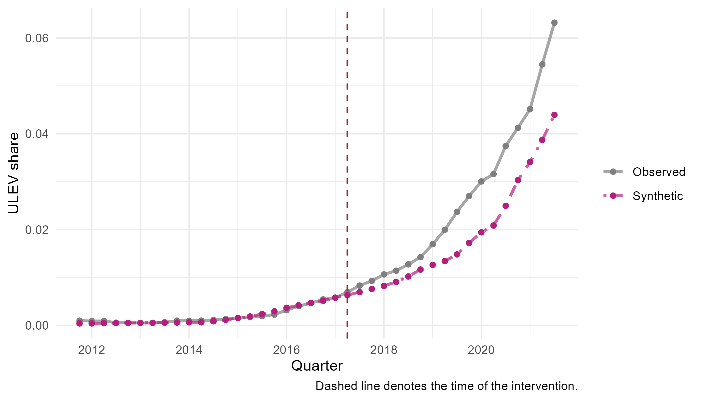
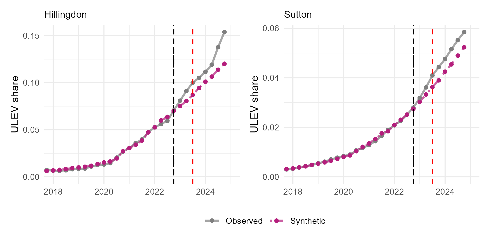
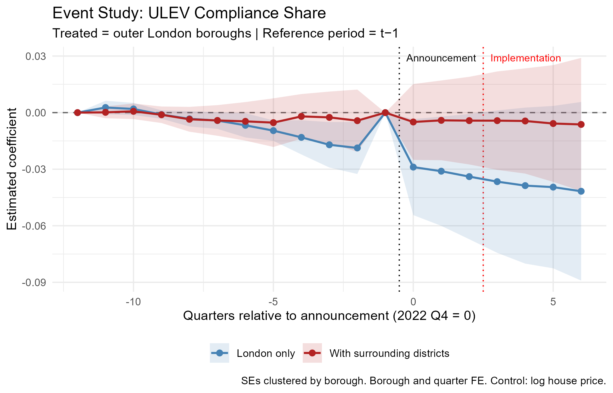

```{r}
#| label: setup
#| include: false

library(here)
library(dplyr)
library(knitr)
library(kableExtra)
library(modelsummary)
library(fixest)
```

# Introduction

Standard models of regulatory compliance assume behavioural change occurs at the point of implementation. But agents who are forward-looking need not wait. If they form rational expectations in the sense @muth1961 first formalised, credible future policy can alter present behaviour well before enforcement begins. Whether it does depends on belief. @kydland1977 showed that a policy's effectiveness turns on its credibility: agents who expect it to be implemented adjust in advance, while a commitment seen as reversible or discretionary is ignored. The deeper point is Lucas's [-@lucas1976]. Because the decision rules we estimate already carry agents' expectations about future policy, those rules are not invariant across policy regimes. Applied to the gap between announcement and enforcement, this implies that treating behaviour as static until the rule takes effect misspecifies the underlying decision problem. A credible announcement may therefore be a policy instrument in its own right.
 
The London Ultra Low Emission Zone (ULEZ) provides a natural setting for testing this. Launched in April 2019 under Mayor Sadiq Khan, the scheme charges non-compliant vehicles a daily fee to enter the zone, aiming to reduce the air pollution affecting Londoners' health. Two features make it a useful case. Each expansion was announced well before it took effect, and the zone expanded three times between 2019 and 2023, giving repeated windows between a credible announcement and its enforcement in which anticipation can be looked for. The 2023 London-wide expansion illustrates the pattern: proposed in March 2022, confirmed that November, and implemented nine months later in August.

The paper addresses two questions. Did each ULEZ expansion generate anticipatory compliance before implementation? And does the anticipatory effect vary across the three expansions? Both follow from the theoretical claim at the centre of this study: that a credible announcement functions as a policy instrument in its own right, capable of shifting behaviour before enforcement. If this holds, compliance should rise in the window between a credible announcement and its implementation. Whether it does, and whether the response weakens as successive expansions convey less new information, is what the analysis sets out to test.

The analysis uses synthetic control as its primary method. For each treated borough, the method builds a counterfactual from a weighted combination of untreated units, which avoids reliance on the parallel trends assumption required by difference-in-differences. The donor pool for each expansion draws on units not yet treated in that wave: for the 2019 and 2021 expansions this includes outer London boroughs alongside the surrounding districts, while for the 2023 London-wide expansion, where every London borough is eventually treated, the donor pool rests on the surrounding never-treated districts alone. The dataset covers 52 units: 33 London boroughs and 19 surrounding districts serving as never-treated controls. These form a balanced quarterly panel running from 2011 Q4 to 2024 Q4. The outcome is the ultra low emission vehicle (ULEV) share of licensed cars, constructed from DVLA vehicle licensing records. The synthetic control results are tested against two-way fixed effects difference-in-differences, an event study, and interrupted time series specifications, with a geographic regression discontinuity design considered but limited by the small number of boroughs near the zone boundary.

The analysis finds anticipatory compliance concentrated in particular boroughs rather than spread across London, and modest throughout. The clearest signs appear for the 2019 and 2023 expansions; the 2021 expansion, despite the longest anticipation window, produces nothing significant. Section 5 reports the borough-level results in full.

This study makes three contributions. Theoretically, it extends the literature on anticipatory behaviour, developed largely outside environmental regulation, to a domain where compliance requires a costly and durable purchase. Empirically, it tests this mechanism across three repeated waves of the same policy, where existing work has largely examined single policy events, tracing the anticipatory response as the policy moves from novel to familiar. Methodologically, it uses districts bordering Greater London as never-treated controls, a donor pool that shares the commuter exposure of outer London boroughs without being subject to the zone itself, providing a cleaner counterfactual than inner London boroughs that were themselves treated in earlier waves.

The dissertation proceeds as follows. Section 2 sets out the policy background and Section 3 the theoretical, empirical, and methodological literature. Section 4 describes the data and design, Section 5 the main results, Sections 6 and 7 the robustness and heterogeneity analyses, and Section 8 the discussion.

# Policy Background

ULEZ is a charging scheme run by Transport for London (TfL) under the Mayor of London. Vehicles that do not meet specified exhaust emission standards pay a daily fee of £12.50 to drive within the zone, applied at all hours. Petrol cars and vans must meet the Euro 4 standard, diesel cars and vans the Euro 6 standard, and motorcycles and mopeds the Euro 3 standard. What matters is the emission standard, not the fuel: a Euro 4 petrol or Euro 6 diesel car is exempt from the charge, as are fully electric and most plug-in hybrid vehicles [@transportforlondon]. ULEV adoption is therefore one route to compliance among several, but a distinctive one. It is the durable, forward-looking capital decision that anticipatory behaviour would predict. The policy aims to improve air quality by lowering concentrations of harmful pollutants, particularly nitrogen dioxide and particulate matter, and to protect public health across London.

ULEZ evolved gradually from London's earlier clean air policy, building on the 2003 Congestion Charge and the 2008 Low Emission Zone that targeted heavy vehicles [@smith2023]. It was introduced to address illegal levels of air pollution, then accelerated and launched in central London by Mayor Sadiq Khan in 2019, driven by mounting public health concerns and a series of legal defeats over the UK's failure to meet its air quality obligations [@mayoroflondon2019]. Because of these earlier schemes, London drivers were already familiar with zone-based charging, and the enforcement infrastructure of cameras and Automatic Number Plate Recognition (ANPR) was already in place. That existing apparatus made later ULEZ announcements credible. A commitment to expand the zone was believable because the equipment to enforce it already existed.

Launched on 8 April 2019, London's initial 24-hour ULEZ was mapped to the central Congestion Charge Zone, covering roughly 21 square kilometres and taking in the high-density commercial core [@c40cities2016]. The scheme was first proposed in 2015 under Mayor Boris Johnson. The decisive signal came on 4 April 2017, when Mayor Sadiq Khan announced the April 2019 launch date and brought the timetable forward [@transportforlondon2017]. The same 2017 announcement also flagged a planned extension to the North and South Circular roads, formally confirmed on 8 June 2018 with an implementation date of 25 October 2021 [@transportforlondon2018]. This April 2017 announcement is the point from which anticipatory responses to the central zone are measured in the analysis that follows.

The inner expansion to the North and South Circular roads was confirmed in June 2018 and implemented on 25 October 2021 [@transportforlondon2018]. Charges and emission standards stayed identical to the central zone, but the scale jumped sharply, covering an area roughly eighteen times larger and bringing about 3.8 million residents within the zone [@mayoroflondon2021]. At over three years, the gap between confirmation and enforcement is the longest of the three expansions, giving the widest window in which anticipatory compliance could occur.

The scheme was then proposed for a London-wide expansion in March 2022, confirmed in November 2022, and implemented on 29 August 2023, leaving a nine-month window between confirmation and enforcement [@mayoroflondon2022]. This was the largest expansion, bringing all 32 London boroughs and the City of London within the zone (@fig-map). Its credibility was tested in court. A coalition of five councils, the outer London boroughs of Bexley, Bromley, Harrow and Hillingdon together with Surrey County Council, challenged the expansion in the High Court, but the challenge failed in July 2023 and enforcement proceeded as announced [@topham2023]. That the commitment held despite legal challenge reinforced the signal to drivers that the deadline was firm.

{#fig-map}

Three things made these commitments credible. Each expansion went through statutory public consultation and formal confirmation, so the policy visibly followed a legally prescribed procedure and not an arbitrary mayoral decision. The camera and ANPR network was already in place, which meant the announced restrictions could be monitored and penalties imposed from the first day of enforcement. Most decisive was track record. The 2019 and 2021 expansions were both delivered on their announced timetables, so by the time the 2023 expansion was confirmed, drivers had twice seen the Mayor commit to a future extension and carry it out. Announcements that might once have read as provisional intentions had become commitments road users could expect to be honoured.

# Literature Review

The review develops the theoretical framework, weighs the empirical evidence, and reviews the methodological literature that motivates the research design.

## Theoretical Framework

Anticipatory behaviour starts from a simple premise: agents decide using information about both current and expected future conditions. Muth's rational expectations hypothesis supplies the micro-foundation. @muth1961 argued that agents do not form systematically biased expectations of future economic variables; on average their expectations match what the relevant economic model predicts, given the information they hold. Expectations formed this way absorb whatever information is available, including credible signals about future policy, instead of leaning only on past experience or waiting for change to arrive. Muth developed this for commodity prices, but the logic carries over to announced regulatory costs. When policymakers signal a future rise in the cost of owning or running a non-compliant vehicle, that information matters at once, not only when the regulation takes force. A forward-looking owner then has reason to weigh the future cost of keeping a non-compliant vehicle against the cost of replacing or scrapping it before enforcement begins. Ignoring information already revealed would itself be irrational, though the timing of any individual response still depends on the cost of adjustment.

This has a direct consequence for how policy effects should be read empirically. If agents build anticipated policy into present decisions, then behaviour before implementation may already reflect the future policy environment. @lucas1976 formalised the point through the Lucas critique: the estimated relationships used to evaluate policy cannot be assumed to hold fixed across policy regimes, because those relationships already embed agents' expectations about the environment. Once a future policy is announced, agents revise their decision rules to fit the expected environment. The period before implementation is therefore not necessarily an undisturbed baseline against which effects can simply be measured. The Lucas critique is usually invoked as a warning against naive before-and-after comparisons, but here it does more constructive work. Behaviour changing before enforcement is not a nuisance to be purged; it is the phenomenon of interest. This paper treats pre-implementation adjustment as the object of study and asks whether the announcement produced measurable changes in vehicle compliance before the ULEZ expansion came into force.

Whether such adjustment occurs depends on one further condition. Agents respond to announced policy only if they believe it will actually be implemented as announced. @kydland1977 showed that expectations turn not just on what policymakers announce but on how credible the announcement is. If agents expect a policy to be delayed, reversed, or watered down before implementation, the future cost stays uncertain and there is little reason to bear the cost of adjusting early. Where the commitment is instead seen as credible and durable, the expected future cost becomes certain enough to move present behaviour. Credibility is the mechanism that links announcement to response. It also bears directly on differences across the successive ULEZ expansions. Variation in anticipatory compliance across waves need not mean rational expectations have failed; it may reflect differences in the information content or perceived credibility of each announcement. As credible commitments accumulate, later announcements may carry less that is genuinely new, shrinking the scope for further adjustment even while the policy stays fully credible.

The three results combine into one framework. Agents fold credible information about future policy into current decisions, so adjustment can begin before implementation and the pre-implementation period cannot be treated as an unaffected baseline, but only when the announcement is believed. The prediction is conditional: forward-looking agents adjust early only when the gain from acting ahead outweighs the cost, so responses should be partial and uneven, not uniform. These components have been studied separately, but not brought together to examine anticipatory responses to geographically bounded environmental regulation before implementation. That intersection is what this dissertation addresses.

## Empirical Evidence

The framework set out when anticipatory responses should occur. Whether they have actually been observed is the next question. One body of evidence shows that credible policy announcements can move behaviour before implementation across many settings; a separate one shows that low-emission zone policies change vehicle compliance. The two strands have largely grown up apart.

The closest empirical analogue is @mills2022, who study behavioural responses to the announcement of mandatory COVID-19 certification. Using a synthetic control design, they find that vaccination rates start rising roughly twenty days before certification took force, so a credible announcement of a future access restriction moved behaviour ahead of legal enforcement. They deliberately backdate the intervention period to capture anticipation instead of treating implementation as the sole moment of exposure, which makes their design conceptually and methodologically close to this one. The main difference is the treatment. COVID certification was national, applying to everyone at once, whereas the ULEZ expansion is geographically bounded, leaving areas outside the zone untreated under the same regional conditions and giving a sharper counterfactual. Mills and Rüttenauer establish the phenomenon in public health policy, but leave open whether it also arises in geographically targeted environmental policy.

@malani2015 supply the framework for reading such responses. Studying tort reform across US states, they argue that apparent pre-treatment trends in difference-in-differences designs are not automatically a violation of parallel trends; they may instead be genuine behavioural responses to announced policy. The distinction matters here, where a rise in ULEZ-compliant vehicles before implementation could be read either as an underlying trend or as anticipation. Their work gives the econometric language for telling the two apart, instead of assuming that any pre-implementation movement must be confounding. It also anticipates the methodological discussion below, showing why empirical designs have to account for anticipation explicitly when estimating policy effects.

Related evidence comes from @ito2018, who find that Japanese manufacturers adjusted vehicle weight strategically ahead of fuel-economy thresholds, extending the bunching framework of @saez2010. These are supply-side responses to regulatory notches, not household replacement decisions, but they carry the same lesson: known future thresholds trigger strategic adjustment before they bind. The behavioural margin and the institutional setting differ from an emission zone, yet the underlying logic is shared.

A separate literature looks at how low-emission zones reshape fleet composition after implementation. @ellison2013 give the foundational study of London's 2008 Low Emission Zone, tracking changes in the heavy-vehicle fleet alongside modest falls in particulate emissions through before-and-after comparison. Their analysis is descriptive and uses no formal counterfactual, but it confirms that DVLA licensing data pick up meaningful fleet responses to emission-zone policy, which supports the outcome measure used here.

Closest to the present setting is @wolff2014, who studies Germany's Low Emission Zone programme and finds that owners living nearer an LEZ boundary were more likely to register cleaner vehicles, a spatial gradient in compliance driven by proximity to the regulated area. Geographically defined environmental policy, in other words, can produce measurable shifts in registration behaviour. But Wolff looks at compliance once the policy is already in force, while this dissertation looks at the anticipatory period between announcement and implementation. The gap is the point: existing work shows that geography shapes compliance once regulation exists, not whether geographically bounded announcements move behaviour before enforcement begins.

@zhai2021 add to this with an instrumental variables analysis of London's Low Emission Zone, finding that compliance responses differed across implementation phases, with short-run adjustments diverging from longer-run environmental gains. Fleet responses, on their evidence, evolve over time instead of following a simple monotonic path, useful context for reading behavioural adjustment around successive expansions.

Two findings emerge from these literatures. Credible policy announcements can trigger anticipatory responses across many policy domains, and geographically defined emission zones produce measurable compliance changes once implemented. What no study has done is join the two: to ask whether announcements of geographically bounded emission-zone expansions generate measurable compliance responses before implementation. Answering that needs a design that can identify anticipation while building a credible counterfactual, which is where the methodological literature below comes in.

## Methodological Literature

The previous section implied that identifying anticipatory behaviour needs a design meeting two conditions. It must construct a credible counterfactual without assuming an undisturbed pre-treatment period, and its comparison units must stay genuinely unaffected by the policy announcement. Because anticipation can emerge before implementation, the question is not whether outcomes change after enforcement, but which strategies can isolate the behavioural response to the announcement itself while still supporting valid inference from a small number of treated units.

Synthetic control is the principal framework for meeting these requirements. Introduced by @abadie2003 and formalised by @abadie2010, it estimates the counterfactual for a treated unit by building a weighted combination of untreated units that reproduces the treated unit's pre-treatment trajectory. Instead of assuming treated and untreated units would have moved in parallel, the estimator uses observed pre-treatment outcomes and predictors to approximate what would have happened without treatment. That suits the present setting well. As the theoretical discussion suggests, announcements may already be shifting behaviour before implementation, which makes the pre-treatment period an unreliable benchmark if the two groups are simply assumed to evolve together. Synthetic control builds that benchmark from the data instead. @abadie2015 add placebo-based inference, testing whether the estimated effect is unusually large against placebo effects generated by reassigning treatment to each donor unit in turn. Significance then comes from where the treated unit sits in the placebo distribution, not from conventional sampling theory. Inference therefore depends on how large the donor pool is, and placebo diagnostics stay informative alongside reported p-values. @abadie2021 draws the literature together and stresses one requirement central to this dissertation: donor units must be plausibly unaffected by the intervention, and pools that are too large or too heterogeneous can weaken the counterfactual.

The choice of comparison units also draws on the literature on staggered adoption. @goodman-bacon2021 shows that two-way fixed effects estimators in staggered settings decompose into many two-by-two comparisons, some using already-treated units as controls for later-treated ones. Where treatment effects are heterogeneous or evolve over time, those comparisons can bias the estimate and even attach negative weights. @callaway2021 solve this by estimating group-time average treatment effects that use only never-treated or not-yet-treated units as comparisons. That maps directly onto the successive ULEZ expansions, where treatment arrives in waves rather than all at once. It justifies building donor pools from units not yet exposed to the relevant announcement, and it explains why conventional two-way fixed effects difference-in-differences serves here as a robustness check, alongside event-study and interrupted time-series specifications, rather than as the primary strategy.

A further perspective comes from the geographic regression discontinuity literature. @keele2015 set out the conditions under which administrative boundaries identify causal effects: continuity of potential outcomes, no coincident treatments, and enough observations near the discontinuity; @dell2010 shows the design recovering persistent effects where those hold. The ULEZ boundary makes a geographic RD available in principle, but the few boroughs near it and broader administrative differences across it make the assumptions far more demanding than those behind synthetic control. Section 6 assesses it for feasibility rather than as a robustness check.

These contributions set the principles behind the empirical strategy used here. The design has to build an explicit counterfactual instead of assuming parallel trends, compare treated units only with areas plausibly unaffected by the relevant announcement, and support credible inference despite few treated units. Synthetic control is therefore the primary design, using never-treated surrounding districts alongside not-yet-treated London boroughs as donors, with placebo-based inference. Two-way fixed effects difference-in-differences, event-study, and interrupted time-series specifications provide the robustness checks, while a geographic regression discontinuity design is assessed for feasibility but cannot be credibly identified at borough level.

# Data and Study Design

## Data Sources and Construction

The outcome is the share of licensed cars in each local authority classified as ULEVs. Vehicle registration data come from the UK Driver and Vehicle Licensing Agency (DVLA) quarterly licensing statistics, tables VEH0132 and VEH9901 [@departmentfortransportanddriverandvehiclelicensingagency2026]. The ULEV classification follows Department for Transport convention, covering vehicles that emit below the prevailing carbon dioxide threshold, mainly battery electric and plug-in hybrid cars [@departmentfortransportanddriverandvehiclelicensingagency2026]. The numerator is the count of licensed ULEVs in each local authority; the denominator is the total count of licensed cars in the same area. The measure is therefore the proportion of the local fleet classified as ULEV. This is a stock, not a flow. It reflects the composition of the existing fleet rather than new registrations, so any behavioural response to a ULEZ announcement should build up gradually as households replace or retire vehicles, not appear all at once.

As Section 2 noted, ULEV ownership is not the same as ULEZ compliance. Petrol vehicles meeting Euro 4 and diesel vehicles meeting Euro 6 are equally exempt from the charge without being ULEVs. The ULEV share is used precisely because it captures adjustment that goes beyond the compliance threshold rather than just meeting it. A household that swaps a non-compliant vehicle for a compliant diesel satisfies the charge; a household that buys a ULEV commits to a lower-emission vehicle beyond what the regulation demands, a choice that speaks more to expectations about where regulation is heading than to a minimal response to a known cost. That is the behavioural margin the framework predicts. It also sets the interpretation of the estimates: they are a lower bound on the total compliance response, because households that moved to a compliant petrol or diesel vehicle never enter the outcome measure.

The analysis uses a balanced quarterly panel of 52 local authorities from 2011 Q4 to 2024 Q4, giving 2,756 observations. The panel holds the 33 Greater London authorities (the 32 London boroughs and the City of London) and 19 surrounding district authorities. The districts are chosen by a transparent geographic rule. Greater London's boundary is taken as the union of the 33 borough geometries [@greaterlondonauthority], and every district authority with any part of its boundary within two kilometres of that line enters the panel. The rule picks out districts immediately adjoining London and stops short of more distant, less comparable authorities. None was ever subject to the ULEZ charge.

The panel also carries several socio-economic and transport variables used in the robustness and heterogeneity analyses: the Index of Multiple Deprivation, Public Transport Accessibility Levels, median house prices, car ownership, population density [@odell2018], and household income [@officefornationalstatistics2026]. These do not enter the synthetic control weights, which are fitted on the pre-treatment outcome path alone. They serve only as additional evidence on how robust and how heterogeneous the estimated effects are.

## Treatment Timing and the Dating Rule

The analysis dates each ULEZ expansion to the point at which it became a firm, credible commitment, not to the date charging began. This follows from the framework in Section 3. If forward-looking agents respond to credible announcements of future costs, adjustment should start once implementation becomes certain, not once the policy takes effect. The treatment date for each expansion is therefore the earliest point at which the public could reasonably treat it as committed rather than as a proposal still open to revision.

| ULEZ Expansion | Treatment Date | Rationale |
|:-----------------|:-----------------|:----------------------------------|
| Central London (2019) | 2017 Q2 (4 April 2017) | The central ULEZ had already been confirmed under the previous Mayor in March 2015 for implementation in 2020. The April 2017 announcement brought the implementation date forward to April 2019, altering the timing of an already-committed policy rather than creating a new commitment. |
| Inner London (2021) | 2018 Q2 (8 June 2018) | The same April 2017 announcement set out an intended extension to the North and South Circular roads, but implementation remained subject to statutory consultation. The policy became a firm commitment only when the expansion was formally confirmed following that consultation. |
| Outer London (2023) | 2022 Q4 (25 November 2022) | The March 2022 consultation proposed a London-wide expansion, with implementation contingent on the statutory consultation process. The confirmed decision of 25 November 2022 represents the point at which the expansion became a credible commitment. |

: Treatment dates by expansion wave {#tbl-dates}

The 2019 and 2021 expansions need separating with care, because both appear in the same April 2017 announcement, yet that announcement said something different about each. For the 2019 central zone, the commitment already existed. The policy had been confirmed in 2015, and April 2017 only pulled its implementation forward from 2020 to 2019. For the 2021 inner expansion, the same document announced an intended future extension that still had to clear statutory consultation before it could be confirmed. The two policies sat at different stages of the same process, so the announcement carried different information for each: for one it revised the timing of an existing commitment, for the other it signalled an intention that had not yet hardened into one.

The results are then tested against alternative dating rules. For 2019, one specification moves treatment to the November 2017 confirmation instead of the April 2017 acceleration. For 2021, a mirror-image specification moves it back to the initial April 2017 proposal instead of the June 2018 confirmation. Applying symmetric alternatives across the two waves checks whether the estimated anticipatory effects hinge on exactly where treatment is dated.

The anticipation windows themselves differ across the three waves. About two years separate the April 2017 announcement from the central London launch in April 2019. The gap between the June 2018 confirmation and the October 2021 inner expansion is longer, roughly three years and four months. The outer London expansion has a much shorter window, about nine months between confirmation in November 2022 and implementation in August 2023. These gaps follow the institutional timetable of each expansion, not any modelling choice, and they set the wave-specific estimation windows described below.

## Donor Pool Construction

The validity of synthetic control turns not only on how well treated and comparison units match, but also on the composition of the donor pool the synthetic control is built from. As Section 3 noted, @abadie2021 argues that donor units should be plausibly unaffected by the intervention, and that pools which are too large or too heterogeneous can weaken the counterfactual. Donor pool construction is treated here as a substantive design choice, not a technical afterthought.

Because this dissertation studies anticipatory responses to announcements, not responses to implementation, treatment status uses the announcement dates from Section 4.2. A local authority counts as untreated only until the announcement that credibly commits it to a future expansion. This follows from the framework in Section 3 and matches the emphasis of @goodman-bacon2021 and @callaway2021 on using never-treated or not-yet-treated comparison groups under staggered adoption. In an announcement-based design, "not yet treated" means units not yet exposed to a credible announcement, not units that have yet to reach an implementation date.

The resulting donor pools differ across the three expansions.

| Expansion | Donor Pool Size | Composition |
|:-----------------|:-----------------|:-----------------------------------|
| 2019 | 38 | 19 surrounding districts + 19 outer London boroughs |
| 2021 | 38 | 19 surrounding districts + 19 outer London boroughs |
| 2023 | 19 | 19 surrounding districts |

: Donor pool composition by expansion wave {#tbl-donors}

The main consequence of this definition is for the 2019 analysis. The 2021 expansion was not implemented until October 2021, but six inner London boroughs — Hammersmith and Fulham, Haringey, Kensington and Chelsea, Lewisham, Newham, and Waltham Forest — already fell within the extension boundary set out in the announcement of 4 April 2017. Under an announcement-based design, those boroughs became treated at the same moment as the 2019 expansion, even though charging did not start for years. Using them as donors would mean asking comparison areas to have already received the exact policy signal the analysis is trying to isolate. They are excluded from the 2019 donor pool.

The outer London boroughs are a different case, and stay eligible as donors for both 2019 and 2021. The 4 April 2017 announcement did set out changes for heavy vehicles in outer London from 2020, but those did not touch private cars, the outcome studied here. For private vehicle owners, the relevant announcement came only with the London-wide confirmation of November 2022. Outer London boroughs therefore meet the untreated definition for the two earlier waves.

For 2023, the donor pool has to shrink to the 19 surrounding districts. By the time the London-wide expansion was confirmed in November 2022, every London borough had either already entered the ULEZ or been credibly committed to joining it, so none met the announcement-based definition of untreated. The districts-only pool is forced by the policy's own history, not chosen for methodological convenience, and the smaller pool has direct consequences for inference, taken up in Section 4.6.

The 19 surrounding districts are central to the design. They share labour, commuter, housing, and vehicle markets with outer London yet were never charged, which studies of nationwide policy cannot offer: in @mills2022 COVID-19 certification setting, every unit is exposed at once and no untreated geographic comparison exists.

A geographic regression discontinuity design was also considered, since the ULEZ boundary is a real administrative discontinuity. Its feasibility depends on having enough comparable units near the boundary, so it is evaluated separately in Section 6. Section 6 also examines what the donor-pool construction adopted here implies empirically, and the next subsection turns to whether the surrounding districts themselves respond to ULEZ announcements.

## What the Design Identifies

The donor pool in Section 4.3 rests on the requirement that comparison units be plausibly unaffected by the treatment. Here, though, policy coverage and behavioural exposure need to be kept apart. The 19 surrounding districts were never subject to the ULEZ charge, but many of their residents commute into London and may well have responded to announcements of future expansions. The data bear this out: the DiD-ITS analysis in Section 6 finds a positive level shift in ULEV share of about 0.022 among the surrounding districts around the November 2022 announcement, no smaller than the shift across outer London itself.

This shared movement does not undermine the design, because the estimator removes changes common to the treated unit and its donor pool. The change in any treated borough splits into a component shared across the region and a borough-specific component; matching on pre-treatment paths differences the common part out. If a borough and its synthetic counterpart accelerate by the same amount, the estimated effect is zero, whether or not both series rose. So the aggregate null for 2023 is fully consistent with ULEV adoption rising everywhere at once, provided it rose similarly in treated and comparison areas.

This shapes how the estimates should be read. They do not measure the total anticipatory compliance an announcement generated. They measure differential anticipatory compliance: the response over and above what otherwise comparable areas did. Changes uniform across the wider London travel-to-work region are removed by the estimator and do not show up in the treatment effects. This scope condition holds throughout the dissertation and matters when reading the results. Section 8 returns to how such common movement might have arisen.

## Estimation

The synthetic control estimator uses only information observed before the relevant announcement. Matching is on two predictors drawn from the outcome variable: the mean pre-treatment ULEV share over the optimisation window, and the ULEV share in the final quarter before the announcement. No external covariates enter the matching. The optimisation works from the outcome's own history instead.

The predictors anchor the optimisation, but the weights are chosen to minimise prediction error in every quarter of the pre-treatment window, so the synthetic control is fitted to the whole pre-announcement path, not a handful of summary statistics. This follows @abadie2021, who argues that the pre-treatment path already captures observed and unobserved determinants of the outcome, reducing the need to match on covariates directly.

Each expansion uses a different optimisation window to fit its announcement date, kept comparable where possible. For 2019 the window runs from 2014 Q1 to 2017 Q2, 14 pre-treatment quarters. For 2021 it is an equally long 14 quarters, from 2015 Q1 to 2018 Q2; holding the two windows to the same length makes their synthetic controls easier to compare despite the different announcement dates. For 2023 the window covers 2019 Q1 to 2022 Q4, 16 quarters before the November 2022 announcement. It begins in 2019 Q1, once the central London zone was in force. The window does span the October 2021 inner London implementation, but neither the treated outer boroughs nor the surrounding districts sat inside that zone, so any effect is common to both groups and is differenced out.

For 2019 and 2021, 38 donor units against 14 pre-treatment observations often produces very small pre-treatment mean squared prediction errors (MSPEs). Close fits like these are expected when the donor pool is rich enough to reproduce the treated unit's history, and a close pre-treatment fit does not on its own invalidate the results. The same optimisation runs on every placebo unit, so any tendency to overfit hits the treated borough and the placebo distribution alike. What the inference rests on is not the absolute size of the pre-treatment MSPE, but whether the treated borough's post-treatment divergence is unusually large against the placebo exercises.

## Inference

Inference rests on the placebo framework of @abadie2010 [-@abadie2015], introduced in Section 3. Instead of leaning on conventional sampling theory, synthetic control judges the estimated effect by comparing it against a distribution of placebo effects, built by assigning treatment to each donor unit in turn. The treated borough's effect is read relative to the effects that emerge when the same procedure runs on units never exposed to the announcement. The p-value is the treated unit's rank within the placebo distribution, ordered by the size of the estimated effect, divided by the total number of treated and placebo units. A rank of one is the largest divergence in the sample, and the p-value it yields is a non-parametric measure of whether the observed effect is unusually large under the null of no treatment effect.

Because placebo inference depends on how many comparison units exist, the attainable p-values are bounded by the donor pool. For 2019 and 2021, the pool holds 38 donors, so 39 units in total and a minimum attainable p-value of 0.026. For 2023, the districts-only pool holds 19 donors, giving 20 units and a floor of 0.05. Hillingdon and Sutton, which reach p-values of exactly 0.05, are ranked first in their placebo distribution and cannot go lower whatever the size of their estimated effect. P-values should therefore be read together with the size and persistence of the effects, not on their own, and p-values from the 2023 wave should not be compared directly with the earlier waves without caution.

Inference also draws on the ratio of post-treatment to pre-treatment mean squared prediction error (MSPE), following @abadie2015. The ratio weighs the size of the estimated effect against the quality of the pre-treatment fit, a scale-independent measure of the divergence between a treated borough and its synthetic counterpart. It is most useful when pre-treatment fit varies across units, or when the minimum p-value is capped by the pool size. The City of London shows why raw gaps can mislead. Its anticipation gap is the largest of the 2019 treated boroughs, yet its MSPE ratio is only 3.7, because the synthetic control never tracked its pre-treatment path closely. A large post-treatment divergence means little when the pre-treatment match was poor, and the City accordingly sits near the bottom of the placebo distribution. Reading the placebo rank and the MSPE ratio together gives a fuller picture than either alone.

Section 6 then checks the findings against alternative identification strategies and modelling assumptions, and Section 7 examines heterogeneity by vehicle keepership and fuel type.

# Results

This section reports the synthetic control estimates for the three ULEZ expansion announcements, under the specifications set out in Section 4. Results are given separately for the 2019 central London expansion, the 2021 inner London expansion, and the 2023 London-wide expansion. @tbl-sc-results summarises the main estimates for each wave, and full results for all treated boroughs are in Appendix B. As set out in Section 4.6, significance is judged jointly from each treated unit's placebo rank and its post-/pre-treatment MSPE ratio, not from the estimated anticipation gap alone.

```{r}
#| label: tbl-sc-results
#| tbl-cap: "Synthetic control estimates by expansion wave. Boroughs with $p \\leq 0.20$ are shown; full results appear in Appendix B."
#| echo: false

readRDS(here("output", "results_table_main.rds")) |>
    select(expansion, borough, anticipation_gap, mspe_ratio,
           rank, fishers_exact_pvalue) |>
    kable(digits = 3, booktabs = TRUE,
          col.names = c("Expansion", "Borough", "Anticipation gap",
                        "MSPE ratio", "Rank", "p-value")) |>
    kable_styling(latex_options = c("striped", "hold_position"))
```

## The 2019 Central Expansion

Of the eight boroughs in the 2019 expansion, Tower Hamlets gives the strongest sign of an anticipatory response. Its post-/pre-treatment MSPE ratio is the third-highest in its placebo distribution (753), which puts it at a placebo rank of 3 out of 39 and a permutation p-value of 0.077 (@tbl-sc-results). This is the strongest treated result in the wave, but it does not reach conventional significance.

@fig-th2019 plots the observed and synthetic trajectories for Tower Hamlets. The borough tracks its synthetic counterpart closely through the pre-announcement period, a sign of good pre-treatment fit. After the announcement in 2017 Q2, a positive gap opens and holds over the anticipation period. The estimated anticipation gap is 0.0025, rising to 0.0078 over the full post-announcement period, which runs past implementation in April 2019.

{#fig-th2019 width="90%"}

The result stays marginal because two donor units post larger MSPE ratios than Tower Hamlets. Windsor and Maidenhead has the highest (1123), then Merton (1106), leaving Tower Hamlets third in the distribution. Under the permutation framework in Section 4.6, this means the observed divergence cannot be told apart from the variation among units that received no announcement, at the 5% level.

The remaining treated boroughs - Islington, Camden, Hackney, Westminster, Southwark, and Lambeth - show no anticipatory effect under the primary specification, with permutation p-values from 0.615 to 0.949. Full results for all treated boroughs are in Appendix B.

## The 2021 Inner Expansion

No treated borough reaches conventional significance under the primary specification for the 2021 inner London expansion. Across the six boroughs entering the ULEZ in this wave, the synthetic control estimates show no anticipatory change in ULEV share that can be told apart from placebo variation (@tbl-sc-results).

Hammersmith and Fulham comes closest. Its MSPE ratio is the third-highest in its placebo distribution, a rank of 3 and a permutation p-value of 0.077. The anticipation gap is 0.0148, widening to an average post-announcement gap of 0.0287. Even so, the result sits below conventional thresholds.

The rest are weaker. Newham reaches a permutation p-value of 0.103, Waltham Forest 0.256, Lewisham 0.462, and Haringey 0.692. Kensington and Chelsea has a negative estimated gap relative to its synthetic control.

So the 2021 wave shows no statistically significant anticipatory response in any of its six boroughs. That is striking, because 2021 had the longest anticipation window of the three. Against the marginal evidence for 2019 and the two significant boroughs in 2023, the 2021 estimates stay null at conventional thresholds.

## The 2023 London-wide Expansion

Two boroughs show statistically significant anticipatory responses under the primary specification: Hillingdon and Sutton. Both have the highest post-/pre-treatment MSPE ratio in their respective placebo distributions, a placebo rank of 1 out of 20 and a permutation p-value of 0.05 (@tbl-sc-results). As Section 4.6 explained, the 2023 analysis uses a pool of 19 untreated districts, so 0.05 is the smallest permutation p-value attainable. A rank of 1 is therefore the strongest evidence this design can produce under the specification, not a borderline result.

@fig-sc2023 shows the observed and synthetic trajectories for Hillingdon and Sutton. In both, the observed series tracks its synthetic counterpart closely through the pre-announcement period, then diverges after the announcement in 2022 Q4. The anticipation gap is 0.0081 for Hillingdon and 0.0022 for Sutton, rising to 0.0151 and 0.0048 over the full post-announcement period. Sutton has the higher MSPE ratio (222 against 197) despite the smaller gap, which reflects a closer pre-treatment match.

{#fig-sc2023 width="100%"}

Beyond these two, there is little sign of systematic anticipatory effects across the remaining outer London boroughs. Barking and Dagenham and Harrow each reach permutation p-values of 0.15, and Croydon 0.20. Nine of the nineteen treated boroughs have negative estimated gaps relative to their synthetic controls, the largest being Wandsworth at −0.027. The distribution of estimated effects across outer London sits close to zero, not uniformly positive, with full results in Appendix B.

As Section 4.4 noted, these estimates are divergences relative to the untreated comparison districts. Any response shared by treated boroughs and donor units is removed by construction and does not show up here.

Across the three waves the estimates are modest and uneven, consistent with the prediction in Section 3.1 that responses would be partial rather than uniform. Section 6 tests their robustness and Section 8 returns to their interpretation.

# Robustness Checks

This section asks whether the synthetic control findings hold up under alternative identification strategies and modelling assumptions. Most of the robustness work centres on the 2023 London-wide expansion. The estimation panel for these specifications starts in 2019 Q1, which puts both the April 2017 announcement and the June 2018 confirmation outside the window. The one exception is the alternative-date analysis, which re-estimates the 2019 and 2021 expansions under different treatment timings.

@tbl-twfe-models compares two-way fixed effects (TWFE) estimates under alternative comparison groups. The naive specification sets outer London boroughs against inner London boroughs, with borough and quarter fixed effects and standard errors clustered at the borough level. It gives a negative treatment coefficient of −0.032, significant at the 10% level, with a within-$R^2$ of 0.10. Allowing differential linear trends cuts the level coefficient to −0.007 and it loses significance, while the differential trend itself is −0.0021, significant at the 10% level.

```{r}
#| label: tbl-twfe-models
#| tbl-cap: "Two-way fixed effects estimates of the 2023 announcement effect under alternative comparison groups. The naive specifications use inner London boroughs as controls; the preferred specifications use never-treated surrounding districts."
#| echo: false
#| warning: false

m <- readRDS(here("output", "twfe_models.rds"))

modelsummary(
    list("Naive"            = m$naive,
         "Preferred"        = m$preferred,
         "Naive + trends"   = m$naive_trends,
         "Preferred + trends" = m$preferred_trends),
    stars   = c("*" = 0.1, "**" = 0.05, "***" = 0.01),
    gof_map = c("nobs", "adj.r.squared", "rmse"),
    output  = "kableExtra"
) |>
    kable_styling(latex_options = c("striped", "hold_position", "scale_down"))
```

The preferred specification instead compares outer London boroughs with the surrounding districts that were never treated. Under this comparison the estimated treatment effect falls to −0.004 and is no longer significant, and the within-
𝑅
2
R
2
 drops to 0.002. The differential trend estimate likewise falls to −0.0005, statistically indistinguishable from zero.

The contrast is telling. The apparent effect in the naive specification comes from using inner London boroughs as controls, despite their own earlier exposure to the ULEZ expansions. The fall in within-
𝑅
2
R
2
 from 0.10 to 0.002 means the treatment indicator explains almost none of the residual variation once never-treated units are the comparison. This is direct support for the comparison-group construction in Section 4.3, and a concrete instance of the contamination problem discussed in Section 3.3. The preferred TWFE estimate of −0.004 also matches the synthetic control null for 2023, two independent estimators agreeing.

The event study offers a further test. It estimates dynamic effects using relative-time indicators, with borough and quarter fixed effects, a house price control, and the never-treated districts as comparison. Two pre-treatment periods are dropped as references, since with a single announcement date the full set of interactions is otherwise collinear with the borough fixed effects. Across the pre-announcement period the coefficients run from +0.0007 to −0.0053, all with confidence intervals covering zero, so there is no sign of differential pre-treatment trends between outer London and the districts. After the announcement the effects stay flat, between about −0.004 and −0.006, none significant and with no visible break at the announcement date (@fig-event-study).

{#fig-event-study width="90%"}

Interrupted time series models point the same way, and the most informative version is worth setting out in full. In the preferred difference-in-differences interrupted time series specification, comparing outer London with the surrounding districts, the common post-announcement level shift (+0.0221) and trend change (+0.0154) are both positive and highly significant, a substantial acceleration in ULEV share from 2022 Q4 on. But neither differential parameter is significant: the interaction between outer London and the post-announcement period is −0.0051 (p = 0.32), and the interaction with the post-announcement trend is −0.0008 (p = 0.84). The acceleration is common to treated boroughs and surrounding districts, not specific to outer London. This is the empirical basis for the scope condition in Section 4.4: the districts did not stay static, and any response they shared with outer London is removed by the synthetic control estimator. A simple three-group interrupted time series, by contrast, cannot separate treatment effects from common shocks: inner London, untouched by the 2023 expansion, shows the largest estimated level shift of all (+0.039), which is why the difference-in-differences version is the more informative check.

Alternative announcement dates test whether the findings depend on the treatment timing chosen in Section 4.2. Re-estimating the 2019 expansion on the November 2017 confirmation date gives substantively identical results. Tower Hamlets is still the strongest treated borough, third in the placebo distribution with a permutation p-value of 0.077. Its MSPE ratio rises from 753 to 1201, which reflects the two extra pre-treatment quarters, not stronger evidence of a response. Re-estimating the 2021 expansion on the April 2017 announcement date also leaves the conclusions unchanged: no borough reaches conventional significance, though Newham becomes the closest case (p = 0.077), displacing Hammersmith and Fulham (p = 0.154). The findings hold under both alternative dating conventions.^[Westminster failed to converge under the alternative 2019 specification (a singular matrix in the optimisation); it is far from significance under the primary specification. Placebo distributions comprise 39 units under both, so the p-values are directly comparable.]

A geographic regression discontinuity was also considered but is not feasible at borough level. The optimal bandwidth of 2.24 km leaves only three boroughs inside the 2021 boundary (Lambeth, Lewisham, Waltham Forest) and three outside (Brent, Greenwich, Wandsworth), too few for credible local linear estimation. The running variable also measures distance to the 2021 boundary, which coincides with earlier ULEZ treatment, breaking the no-coincident-treatment assumption.

The robustness checks support the main conclusions and sharpen their scope. The aggregate estimators agree that no effect is large enough to move outer London as a whole relative to the surrounding districts. But these designs estimate an average across all nineteen treated boroughs, with post-treatment confidence intervals of roughly $\pm 0.03$, while the significant synthetic control estimates for Hillingdon (0.0081) and Sutton (0.0022) are an order of magnitude smaller. An effect concentrated in two boroughs is simply diluted in an aggregate specification. The two sets of results do not conflict; they sit at different levels of aggregation and answer different questions.

# Heterogeneity Analysis

This section asks whether the anticipatory responses found for the 2023 London-wide expansion are concentrated in particular segments of the ULEV market. The headline outcome is split two ways: by vehicle keepership, separating company from private registrations, and by fuel type, separating battery electric vehicles (BEVs) from plug-in hybrid electric vehicles (PHEVs). Because 2023 is the only wave with significant synthetic control estimates, the heterogeneity analysis is confined to it. Each outcome is estimated separately, using the same donor pool and procedure, with its own placebo distribution and its own minimum attainable permutation p-value of 0.05.

The keepership split shows little systematic heterogeneity. Hillingdon, one of the two headline-significant boroughs, is significant for company-owned vehicles (rank 1, p = 0.05) but not for private ones (p = 0.15). Harrow reverses this: rank 1 for private vehicles (p = 0.05), no effect for company vehicles (p = 0.35), even though it was insignificant in the headline ULEV analysis (p = 0.15). Sutton shows no clear pattern, with somewhat stronger evidence for private (p = 0.15) than company vehicles (p = 0.25). Across the three, there is no consistent sign that anticipatory responses concentrated in company fleets over private owners.

```{r}
#| label: tbl-heterogeneity
#| tbl-cap: "Disaggregated synthetic control results for the 2023 expansion, by vehicle keepership and fuel type. Boroughs are ordered by their headline ULEV rank; the minimum attainable permutation p-value is 0.05 for each outcome."
#| echo: false

keep <- readRDS(here("output", "keepership_table.rds"))
fuel <- readRDS(here("output", "fuel_table.rds"))

keep |>
    select(borough, pval_company, pval_private) |>
    left_join(fuel |> select(borough, pval_bev, pval_phev), by = "borough") |>
    arrange(pval_company) |>
    kable(digits = 2, booktabs = TRUE,
          col.names = c("Borough", "Company", "Private", "BEV", "PHEV")) |>
    kable_styling(latex_options = c("striped", "hold_position", "repeat_header"))
```

The fuel-type split is more consistent for Sutton. The borough ranks first in the placebo distribution for the headline ULEV outcome and for both BEVs and PHEVs, hitting the minimum permutation p-value of 0.05 in all three. Hillingdon is only partly consistent: significant for PHEVs (p = 0.05) but not for BEVs (p = 0.25). Several other boroughs, Croydon, Ealing, and Richmond upon Thames among them, also reach rank 1 for BEVs while staying insignificant in the headline analysis. Isolated significance on one disaggregated outcome, with no matching effect for total ULEVs, is weak evidence of a systematic response and should be read cautiously.

The heterogeneity analysis also brings out the multiple-comparisons problem. Five outcomes are estimated across nineteen treated boroughs: headline ULEVs, company vehicles, private vehicles, BEVs, and PHEVs. With a twenty-unit placebo distribution, one rank-1 result per outcome is what the null predicts by chance alone. The observed pattern roughly matches that: one rank-1 result for company vehicles, one for private, three for BEVs, two for PHEVs. The exception is Sutton, which ranks first at once for the headline ULEV outcome, BEVs, and PHEVs. These outcomes are correlated, not independent, but ranking first across all three is still stronger evidence than any single isolated result. On balance, the heterogeneity analysis leaves Sutton as the most robust finding in the dissertation, shows that the keepership split points to no clear mechanism, and suggests that isolated fuel-specific results should be treated with caution.

# Discussion and Conclusion

## Summary of Findings 

This dissertation asked whether announcements of the three ULEZ expansions produced anticipatory increases in ULEV share before implementation. The evidence is mixed across the three waves. The 2019 central London expansion gives marginal evidence of a response, with Tower Hamlets ranking third in its placebo distribution (p = 0.077). The 2021 inner London expansion produces no significant effects. The 2023 London-wide expansion yields significant responses in two boroughs, Hillingdon and Sutton. Across all three, the estimated anticipation gaps stay modest: the largest significant effect is less than one percentage point of the licensed fleet. Four complementary estimators back the aggregate 2023 null, none finding a differential response against the surrounding districts. On this evidence, anticipatory compliance is detectable but localised, not a general response to credible policy announcements.

## Interpreting the pattern across waves

The differing patterns fit the framework from Section 3.1, though not monotonically. That framework held that announcements induce anticipatory responses when they carry credible new information, and that as commitments accumulate later announcements carry less. The results support the mechanism, in that the response tracks what each announcement plausibly added, but they do not show the steady decline a straightforward reading would predict.

Two readings fit this pattern. The first is that the 2021 expansion carried little genuinely new information, because it had already been signalled, though not confirmed, alongside the 2019 expansion in the Mayor's April 2017 announcement. By the June 2018 confirmation, much of the commitment may already have been priced into expectations. The robustness analysis in Section 6 supports this: dating the 2021 expansion to the April 2017 signal instead of the June 2018 confirmation leaves the null unchanged. This does not mean the 2023 announcement should have produced the same muted response, since the London-wide expansion hit a different set of boroughs, with different vehicle stocks, commuting patterns, and prior exposure to the policy. A second reading, that the inner London boroughs entering in 2021 already held higher ULEV shares and so had less room to adjust, cannot be ruled out, but the difference was modest and the evidence cannot separate the two.

One feature is common to the significant and near-significant cases. In all four, the post-announcement gap is roughly two to three times the anticipation gap, with divergence beginning after the announcement and continuing through implementation. This fits announcements setting behavioural adjustment in motion that then builds as enforcement nears. But it fits equally well a reading in which enforcement itself drives most of the response, since only the anticipation gap precedes it.

## The common regional acceleration

The robustness analysis turns up a striking feature: the acceleration in ULEV registrations from 2022 Q4 was not confined to the boroughs affected by the 2023 expansion. The difference-in-differences interrupted time series estimates find a significant common level shift across all groups, with increases of roughly +0.018 to +0.039. The surrounding districts that made up the donor pool accelerated at a comparable rate to the treated outer boroughs, and inner London, whose ULEZ status did not change in 2023, recorded the largest increase of all.

Two explanations fit this. One is that the surrounding districts were partly exposed to the policy through commuting. Residents outside Greater London who travel into the capital would also face the ULEZ charge, which could generate anticipatory responses even though they live outside the treated area. The other is that it reflects broader national developments in electric vehicle adoption, such as the planned 2030 phase-out of new petrol and diesel vehicles and high fuel prices through 2022. The design cannot separate the two.

Inner London is the strongest sign that part of the acceleration was unrelated to the 2023 expansion: these boroughs saw no change in policy status, yet their ULEV registrations rose the most of all. This aligns with @tong2025, who find no air-quality improvement after the expansion and attribute it partly to compliance having largely diffused beforehand. Their evidence comes from atmospheric monitoring rather than licensing data, and reaches the same conclusion from an independent system: the announcement landed in a population whose fleet had already shifted. That corroborates the aggregate null here using different data, methods, and outcomes.

## Contribution and Implications

The findings make three main contributions. The first is theoretical: they extend credibility-based theories of anticipatory behaviour to environmental regulation. The framework in Section 3.1 predicted that credible announcements would generate partial and heterogeneous responses, not uniform adjustment. The results bear this out, picking up anticipatory compliance in a handful of boroughs while showing that the response was neither universal nor automatic.

The second is empirical. By examining all three ULEZ expansion announcements rather than a single episode, the dissertation shows that anticipatory responses cannot be read off from policy credibility or the length of the anticipation window alone. The 2021 null is especially telling here, because that wave had the longest interval between confirmation and enforcement of the three, yet produced no significant effect.

The third is methodological, and concerns comparison-group selection in announcement-based evaluation. Section 6 showed that using previously treated inner London boroughs as controls manufactures an apparent treatment effect that vanishes once the comparison is restricted to never-treated surrounding districts. This is direct empirical support for the donor pool used in the synthetic control analysis.

For policy, credible announcements can bring compliance forward for some owners, but the effects are modest and concentrated, and unlikely to substitute for enforcement. This rests on the narrower compliance margin, since the ULEV share misses households that complied by switching to a compliant petrol or diesel vehicle.

## Limitations

Several limitations bear on how the findings should be read.

The first is the level of analysis. Borough-level data cannot show whether adjustment came from households, businesses, commuters, or particular vehicle users. Household- or vehicle-level licensing data would allow sharper tests of who responded and why.

The second is the outcome measure. A rise in ULEV registrations misses other responses to the announcement, such as switching to a compliant petrol or diesel vehicle, driving less, or changing travel patterns, so the estimates capture ULEV adoption, not the full behavioural response.

The third is multiple comparisons. As Section 7 showed, with five outcomes and a twenty-unit placebo distribution roughly one rank-1 result per outcome is expected by chance, and the observed counts sit at or above that. Only Sutton's consistent ranking across three outcomes stands out against chance; the wider heterogeneity results need caution.

The fourth, and most important, is that the 2023 headline rests on two boroughs out of nineteen. Nine of the nineteen had negative estimated anticipation gaps, so the distribution of effects sits close to zero, not uniformly positive. Hillingdon and Sutton may be the upper tail of that distribution rather than genuine anticipatory responses. Their consistent ranking across several disaggregated outcomes, in Section 7, weighs against chance but does not rule it out. The evidence for borough-level anticipatory compliance in 2023 is best treated as suggestive, not conclusive.

Finally, the 2023 estimates are constrained by the donor pool: with nineteen comparison units the smallest attainable p-value is 0.05, so the strongest possible evidence is weaker than a larger pool would allow.

## Conclusion

This dissertation asked whether ULEZ expansion announcements generated anticipatory compliance before implementation, and whether the response varied across policy waves. Anticipatory responses did occur in some settings, but they were neither universal nor consistent: the 2019 central expansion gave marginal evidence in Tower Hamlets, the 2021 inner expansion showed nothing significant, and the 2023 London-wide expansion produced significant responses in Hillingdon and Sutton. The pattern varies across waves, but not monotonically, and the wave with the longest anticipation window produced no effect at all.

The central conclusion is that a credible announcement can move behaviour before enforcement begins, but the effect is small, uneven across places, and far from an automatic consequence of credibility. Where it appeared, it did so as a durable shift toward cleaner vehicles, the forward-looking capital decision the theory predicts, rather than a broad behavioural change. Getting closer to who responds, and how, would take household- or vehicle-level data, which would allow a more direct test of the mechanisms this borough-level analysis can only suggest.

\newpage

# References {.unnumbered}